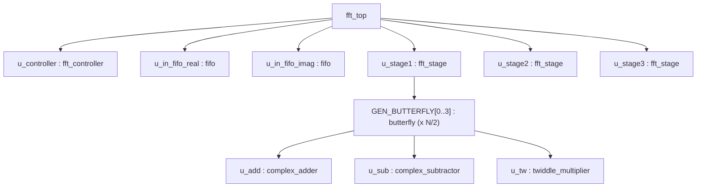

# Streaming FFT Accelerator (SystemVerilog)

A parameterized, fixed-point, **8-point radix-2 FFT accelerator** written in synthesizable SystemVerilog, with a serial streaming interface (one complex sample per clock in, one per clock out), an FSM-based controller, a 3-stage pipelined butterfly datapath, directed self-checking testbenches, and UVM verification environments.

> **Scope statement (read first):** This is a **simplified, interview/education-oriented implementation**, not production FFT IP. Every FFT stage in this design pairs sample `i` with `i + N/2` and broadcasts **one shared twiddle constant per stage** to all butterflies. That structure is correct for the *first* stage of a radix-2 decimation-in-frequency FFT, but stages 2 and 3 reuse the same module unchanged — a textbook FFT recursion would need a shrinking pairing stride and per-butterfly twiddle values in later stages. This simplification is deliberate, is documented in the RTL itself (`rtl/top/top.sv` header), and the self-checking testbench verifies bit-exactness against *this* structure, not against a canonical DFT.

**Author:** Shreenidhi Inamadar

---

## Table of Contents

1. [Project Overview](#1-project-overview)
2. [Design Objectives](#2-design-objectives)
3. [Microarchitecture](#3-microarchitecture)
4. [Datapath Explanation](#4-datapath-explanation)
5. [Control Path](#5-control-path)
6. [Module-Level Microarchitecture](#6-module-level-microarchitecture)
7. [Butterfly Microarchitecture](#7-butterfly-microarchitecture)
8. [Fixed-Point Arithmetic](#8-fixed-point-arithmetic)
9. [FIFO Microarchitecture](#9-fifo-microarchitecture)
10. [Parameterization](#10-parameterization)
11. [SystemVerilog RTL Concepts](#11-systemverilog-rtl-concepts)
12. [Verification Architecture](#12-verification-architecture)
13. [Simulation and Synthesis](#13-simulation-and-synthesis)
14. [Repository Structure](#14-repository-structure)
15. [Design Decisions](#15-design-decisions)
16. [Current Limitations](#16-current-limitations)
17. [Future Improvements](#17-future-improvements)
18. [How I Explain This Project in an Interview](#18-how-i-explain-this-project-in-an-interview)

---

## 1. Project Overview

This project implements a hardware accelerator for the **Fast Fourier Transform (FFT)** — the algorithm that converts a block of time-domain samples into their frequency-domain representation.

**Why FFT instead of direct DFT.** A direct DFT computes N outputs, each a sum over N inputs, costing **O(N²)** complex multiply-accumulates. The FFT exploits the symmetry and periodicity of the twiddle factors `W_N^k = e^(−j2πk/N)` to recursively split the problem, reducing the cost to **O(N·log₂N)**. For N = 8 that is 12 butterflies instead of 64 multiply-accumulate columns; for the N = 1024–4096 sizes used in real systems, the difference is orders of magnitude.

**Why it matters for OFDM.** OFDM transceivers (Wi-Fi, LTE/5G, DVB) modulate data onto orthogonal subcarriers: the transmitter runs an IFFT every symbol, the receiver an FFT. The FFT sits directly in the sample-rate datapath, so it must sustain a fixed throughput at a fixed latency — which is why it is implemented as dedicated hardware rather than software: a hardwired butterfly datapath computes many multiply-adds in parallel every clock, with deterministic timing and far lower energy per transform than a CPU/DSP running the same math sequentially.

**What "streaming" means here.** The accelerator has a serial sample interface: complex samples enter **one per clock cycle** and results leave **one per clock cycle**, with block processing (buffer → compute → drain) hidden behind that interface. In this implementation, one N-sample frame is processed at a time under FSM control (load N samples → compute → drain N results); frames are **not** overlapped/pipelined against each other — see [Current Limitations](#16-current-limitations).

---

## 2. Design Objectives

The objectives below are the ones actually supported by the code in this repository:

| Objective | Where it shows up in the RTL |
|---|---|
| Parameterized RTL | `WIDTH`, `DEPTH`, `N` parameters propagated through the full hierarchy |
| 16-bit datapath | `WIDTH = 16` default on every module; all sample ports `logic signed [WIDTH-1:0]` |
| Fixed-point complex arithmetic | Q1.(WIDTH−1) twiddles, full-width products, arithmetic-shift rescaling in `twiddle_multiplier` |
| Modular RTL architecture | Adder / subtractor / multiplier / butterfly / stage / FIFO / controller / top as separate modules |
| Streaming dataflow | 1 sample/cycle serial input (FIFO-staged) and 1 sample/cycle serial output (`out_valid`-gated) |
| Synthesizable SystemVerilog | `always_ff`/`always_comb`, no delays or non-synthesizable constructs in `rtl/` |
| Reusable modules | Arithmetic primitives instantiated by `butterfly`, which is instantiated `N/2×` per `fft_stage` via `generate` |
| FFT/OFDM-oriented processing | Radix-2 butterfly structure, twiddle constants `W⁰`, `e^(−jπ/4)`, `−j` in Q1.15 |
| SystemVerilog verification | Directed self-checking testbenches in `tb/` |
| UVM verification | Full single-agent UVM environments for `complex_adder` and `complex_subtractor`; a packaged dual-agent UVM environment (predictor, scoreboard, coverage subscriber, virtual sequencer) for `fft_top` |

---

## 3. Microarchitecture

The diagram below is drawn in the style of a processor core-pipeline diagram and reflects the **actual RTL** in `rtl/top/top.sv`: every block, signal, and connection shown exists in the code. Solid lines are data; dashed (`┄`) lines are control. `clk` and `rst_n` (async, active-low) go to every sequential block: both FIFOs, the S2P capture register array, the three pipeline/result registers, the drain/unload pointers, and the controller.

```text
════════════════════════════════════ fft_top  (WIDTH=16, DEPTH=16, N=8) ════════════════════════════════════

  clk ──────┬─────────────┬────────────────┬──────────────────┬─────────────────┬────────────────┐
  rst_n ────┴─(async, active-low)──────────┴───(to every sequential block shown below)───────────┘

──────────────────────────────────────────── DATAPATH ──────────────────────────────────────────────────────

 in_real ──────────►┌──────────────────┐ fifo_out_real
 (1 sample/cycle)   │ u_in_fifo_real   ├───────────────┐
                    │ fifo  WIDTH×DEPTH│               │
 in_imag ──────────►├──────────────────┤               │
                    │ u_in_fifo_imag   ├───────────────┤ fifo_out_imag
                    │ fifo  WIDTH×DEPTH│               │   (FIFO read data is REGISTERED:
                    └──────────────────┘               │    1-cycle read latency)
                      ▲            ▲                   ▼
          fifo_wr_en ┄┘            └┄ fifo_rd_en  ┌─────────────────────────────┐
          (LOAD: N cycles)   (UNLOAD: N pops      │ S2P CAPTURE REGISTER ARRAY  │
                              + 1 settle cycle)   │ stage_in_real[0:N-1]        │
                                                  │ stage_in_imag[0:N-1]        │
                                                  │ write idx: unload_ptr_d1    │
                                                  │ write en : fifo_rd_en_d1    │
                                                  └──────────────┬──────────────┘
                                                                 │  N×WIDTH parallel (real + imag)
   TW1 = 32767 + j0      (W⁰, Q1.15)                             ▼
   ──────────────────broadcast to all N/2──►┌────────────────────────────────────┐
                                            │ u_stage1 : fft_stage               │
                                            │  N/2 = 4 parallel butterfly units  │
                                            │  pairing: index i ◄──► i + N/2     │
                                            └──────────────────┬─────────────────┘
                                                               ▼
                                            ┌────────────────────────────────────┐
                                            │ stage1_reg  (N×WIDTH, real+imag)   │◄┄┄ pipeline_en
                                            └──────────────────┬─────────────────┘
   TW2 = 23170 − j23170  (e^(−jπ/4), Q1.15)                    ▼
   ──────────────────broadcast to all N/2──►┌────────────────────────────────────┐
                                            │ u_stage2 : fft_stage  (unchanged   │
                                            │  structure: i ◄──► i+N/2, 1 twiddle)│
                                            └──────────────────┬─────────────────┘
                                                               ▼
                                            ┌────────────────────────────────────┐
                                            │ stage2_reg  (N×WIDTH, real+imag)   │◄┄┄ pipeline_en
                                            └──────────────────┬─────────────────┘
   TW3 = 0 − j32767      (−j, Q1.15)                           ▼
   ──────────────────broadcast to all N/2──►┌────────────────────────────────────┐
                                            │ u_stage3 : fft_stage  (unchanged   │
                                            │  structure: i ◄──► i+N/2, 1 twiddle)│
                                            └──────────────────┬─────────────────┘
                                                               ▼
                                            ┌────────────────────────────────────┐
                                            │ result_real[0:N-1]                 │◄┄┄ pipeline_en
                                            │ result_imag[0:N-1]  (result reg)   │
                                            └──────────────────┬─────────────────┘
                                                               │ parallel result
                                              drain_ptr ┄┄┄►┌──┴───────────┐
                                              (counts 0..N-1│  OUTPUT MUX  ├──► out_real ─┐ 1 sample
                                               while valid) │ [drain_ptr]  ├──► out_imag ─┘ per cycle
                                                            └──────────────┘
                                                    valid ┄┄┄┄┄┄┄┄┄┄┄┄┄┄┄┄┄┄┄► out_valid

──────────────────────────────────────────── CONTROL PATH ──────────────────────────────────────────────────

                     ┌──────────────────────────────────────────────────────┐
      start ────────►│                u_controller : fft_controller         │
                     │   FSM:  IDLE → LOAD → UNLOAD → COMPUTE → DRAIN →     │
                     │         DONE → IDLE                                  │
                     │   counters: load_count, unload_count, stage,         │
                     │             drain_count                              │
                     └─┬──────┬──────┬──────┬─────┬─────┬─────┬─────┬───────┘
                       ┆      ┆      ┆      ┆     │     │     ┆     ┆
        fifo_wr_en ◄┄┄┄┘      ┆      ┆      ┆     │     │     ┆     └┄┄► stage        ─┐ generated but
        fifo_rd_en ◄┄┄┄┄┄┄┄┄┄┄┘      ┆      ┆     │     │     └┄┄┄┄┄┄┄► feedback_sel ─┤ UNUSED by this
        pipeline_en ◄┄┄┄┄┄┄┄┄┄┄┄┄┄┄┄┄┘      ┆     │     │              butterfly_en ◄┄┘ fixed 3-stage
        valid (→ out_valid, drain_ptr) ◄┄┄┄┄┘     ▼     ▼                               datapath
                                                busy   done      (status outputs of fft_top)
```

A rendered schematic version of the same microarchitecture (commit these SVGs next to the README so the links resolve):

<p align="center"></p>

### Module hierarchy



(`u_stage2` / `u_stage3` instantiate the identical `butterfly` sub-hierarchy; shown once for clarity.)

---

## 4. Datapath Explanation

Step by step, exactly as wired in `rtl/top/top.sv`:

1. **Serial input.** While the controller is in `LOAD` (`fifo_wr_en = 1` for N cycles), one complex sample per clock is pushed into two parallel FIFOs — `u_in_fifo_real` and `u_in_fifo_imag`.
2. **Serial-to-parallel unload.** In `UNLOAD`, the controller asserts `fifo_rd_en` for N cycles. Because `fifo` registers its read data (one cycle of read latency), the capture logic uses the delayed versions `fifo_rd_en_d1` / `unload_ptr_d1` to write each popped sample into the parallel arrays `stage_in_real[0:N-1]` / `stage_in_imag[0:N-1]`, and the FSM spends **N+1** cycles in `UNLOAD` so the last sample lands before compute starts.
3. **Stage 1.** `u_stage1` (`fft_stage`) combinationally applies N/2 = 4 butterflies, pairing index `i` with `i + N/2`, with twiddle constant `TW1 = 32767 + j0` broadcast to all four butterflies. On `pipeline_en`, results latch into `stage1_reg`.
4. **Stage 2.** `u_stage2` applies the *same structure* (same pairing, one shared twiddle `TW2 = 23170 − j23170`) to `stage1_reg`; results latch into `stage2_reg` on `pipeline_en`.
5. **Stage 3.** `u_stage3` does the same with `TW3 = 0 − j32767`; results latch into `result_real/imag[0:N-1]` on `pipeline_en`. `COMPUTE` lasts `log₂N = 3` cycles, advancing all three pipeline registers once per cycle.
6. **Inside each butterfly**, the `complex_adder` produces `P = A + B`, the `complex_subtractor` produces `A − B`, and the `twiddle_multiplier` produces `Q = W·(A − B)` — see [Section 7](#7-butterfly-microarchitecture).
7. **Serial drain.** In `DRAIN` (`valid = 1` for N cycles), `drain_ptr` counts 0…N−1 and the output mux drives `out_real = result_real[drain_ptr]`, `out_imag = result_imag[drain_ptr]`, qualified by `out_valid`. Outputs are drained in **natural index order** — there is no bit-reversal reordering in this design.

**Frame timing (directly from the FSM state durations documented in `fft_controller`):** `LOAD` (N) + `UNLOAD` (N+1) + `COMPUTE` (log₂N) + `DRAIN` (N) = `3N + log₂N + 1` busy cycles per frame — 28 cycles for N = 8 — followed by `DONE` until `start` deasserts. One frame is in flight at a time.

---

## 5. Control Path

`rtl/controller/controller.sv` (`fft_controller`) is a 6-state Moore FSM (`typedef enum logic [2:0]`), with an `always_ff` state register, an `always_comb` next-state block, an `always_comb` output block with safe defaults, and four counters.

| State | Duration | Active outputs | Exit condition |
|---|---|---|---|
| `IDLE` | until `start` | — | `start == 1` |
| `LOAD` | N cycles | `busy`, `fifo_wr_en` | `load_count == N-1` |
| `UNLOAD` | N+1 cycles | `busy`, `fifo_rd_en` (only while `unload_count < N`; final cycle is a settle cycle for the FIFO's registered read data) | `unload_count == N` |
| `COMPUTE` | log₂N = 3 cycles | `busy`, `pipeline_en`, `butterfly_en`, `feedback_sel` | `stage == NUM_STAGES-1` |
| `DRAIN` | N cycles | `busy`, `valid` | `drain_count == N-1` |
| `DONE` | until `start` released | `done` | `start == 0` |

Counters: `load_count` (`$clog2(N)` bits), `unload_count` (`$clog2(N+1)` bits — it must reach N), `stage` (`$clog2($clog2(N))` bits, counts compute cycles), `drain_count` (`$clog2(N)` bits). A `default` next-state arm returns to `IDLE`.

```text
                 start                                        stage == NUM_STAGES-1
        ┌──────────────────┐                                ┌────────────────────────┐
        │                  ▼                                │                        ▼
  ┌──────────┐       ┌──────────┐  load_count  ┌──────────┐ │ unload_count  ┌───────────┐
  │   IDLE   │       │   LOAD   │───── == ────►│  UNLOAD  │─┘──── == N ────►│  COMPUTE  │
  └──────────┘       └──────────┘    N-1       └──────────┘                 └───────────┘
        ▲                                                                        (3 cycles)
        │ !start                                                                      │
  ┌──────────┐          drain_count == N-1              ┌──────────┐                  │
  │   DONE   │◄─────────────────────────────────────────│  DRAIN   │◄─────────────────┘
  └──────────┘                                          └──────────┘
```

**Vestigial signals:** `butterfly_en`, `feedback_sel`, and `stage` are generated by the controller but **not consumed** by the fixed 3-stage cascade in `fft_top` — the RTL comments identify them as leftovers of a resource-shared/feedback (SDF-style) variant this project does not implement. They are kept declared for interface stability.

---

## 6. Module-Level Microarchitecture

Port names below are copied from the RTL.

| Module | File | Purpose | Inputs | Outputs | Hardware Role |
|---|---|---|---|---|---|
| `complex_adder` | `rtl/complex_adder/complex_adder.sv` | `P = A + B` (combinational) | `a_real, a_imag, b_real, b_imag` | `p_real, p_imag` | Datapath |
| `complex_subtractor` | `rtl/complex_subtractor/complex_subtractor.sv` | `Q = A − B` (combinational) | `a_real, a_imag, b_real, b_imag` | `q_real, q_imag` | Datapath |
| `twiddle_multiplier` | `rtl/twiddle_mul/twiddle_mul.sv` | `WB = W × B`, fixed-point rescaled (combinational) | `b_real, b_imag, tw_real, tw_imag` | `wb_real, wb_imag` | Datapath |
| `butterfly` | `rtl/butterfly/butterfly.sv` | Radix-2 butterfly: `P = A+B`, `Q = W·(A−B)` | `a_real, a_imag, b_real, b_imag, tw_real, tw_imag` | `p_real, p_imag, q_real, q_imag` | Processing |
| `fifo` | `rtl/fifo/fifo.sv` | Synchronous FIFO, registered read data, full/empty flags | `clk, rst_n, wr_en, rd_en, data_in` | `data_out, full, empty` | Buffering |
| `fft_controller` | `rtl/controller/controller.sv` | 6-state FSM sequencing load/unload/compute/drain | `clk, rst_n, start` | `busy, done, valid, fifo_wr_en, fifo_rd_en, butterfly_en, pipeline_en, feedback_sel, stage` | Control |
| `fft_stage` | `rtl/stage/fft_stage.sv` | N/2 parallel butterflies, pairing `i ↔ i+N/2` (combinational) | `real_in[0:N-1], imag_in[0:N-1], tw_real[0:N/2-1], tw_imag[0:N/2-1]` | `real_out[0:N-1], imag_out[0:N-1]` | Processing |
| `fft_top` | `rtl/top/top.sv` | Integration: FIFOs + S2P + 3-stage pipeline + drain + controller | `clk, rst_n, start, in_real, in_imag` | `out_real, out_imag, busy, done, out_valid` | Integration |

---

## 7. Butterfly Microarchitecture

For complex inputs `A = Ar + jAi`, `B = Br + jBi` and twiddle `W = Wr + jWi`, **this RTL implements the decimation-in-frequency (DIF) form**:

```text
P = A + B                 (sum path — no twiddle)
Q = W · (A − B)           (difference path — twiddled)
```

> Note: this differs from the DIT form (`P = A + BW`, `Q = A − BW`). In this repository the multiplier sits **after** the subtractor, on the difference path — verified against `rtl/butterfly/butterfly.sv`.

Inside `twiddle_multiplier`, with `D = A − B = Dr + jDi`:

```text
Re(W·D) = Dr·Wr − Di·Wi
Im(W·D) = Dr·Wi + Di·Wr
```

Hardware structure, exactly as instantiated in `butterfly.sv` (all three primitives are combinational):

```text
   A (a_real, a_imag) ──┬─────────────────────►┌────────────────┐
                        │                      │ u_add :        ├──► P (p_real, p_imag)
   B (b_real, b_imag) ──┼──┬──────────────────►│ complex_adder  │       P = A + B
                        │  │                   └────────────────┘
                        │  │
                        ▼  ▼
                 ┌────────────────────┐  diff_real  ┌──────────────────────┐
                 │ u_sub :            │  diff_imag  │ u_tw :               │
                 │ complex_subtractor ├────────────►│ twiddle_multiplier   ├──► Q (q_real, q_imag)
                 │     A − B          │             │  4 mults, 1 sub,     │       Q = W·(A−B)
                 └────────────────────┘             │  1 add, >>> rescale  │
                                                    └──────────▲───────────┘
                                     W (tw_real, tw_imag) ┄┄┄┄┄┘  per-stage constant
```

Per `fft_stage`, `N/2 = 4` copies of this butterfly operate in parallel, butterfly `i` taking `A = sample[i]`, `B = sample[i + N/2]`, and writing `P → out[i]`, `Q → out[i + N/2]`.

---

## 8. Fixed-Point Arithmetic

**Why fixed point:** floating-point units are expensive in area, power, and latency; a 16-bit signed fixed-point datapath gives deterministic, cheap arithmetic appropriate for a sample-rate DSP block.

What the RTL actually implements (`rtl/twiddle_mul/twiddle_mul.sv`):

- All samples and twiddles are `logic signed [WIDTH-1:0]` (16-bit two's-complement).
- The module header explicitly defines the format: inputs/outputs **Q1.(WIDTH−1)** — i.e. **Q1.15** for WIDTH = 16 (1 sign/integer bit, 15 fractional bits), products **Q2.(2·WIDTH−2)**. The twiddle constants encode this: `32767 ≈ +1.0`, `23170 ≈ 0.7071 ≈ 1/√2`.
- The four partial products (`mul_rr`, `mul_ii`, `mul_ri`, `mul_ir`) are computed at **full 2·WIDTH = 32-bit** width — no precision is lost in the multiply itself.
- Combine: `real_temp = mul_rr − mul_ii`, `imag_temp = mul_ri + mul_ir` (32-bit).
- Rescale: `wb_real = real_temp >>> FRACTION_BITS` with `localparam FRACTION_BITS = WIDTH−1` — an **arithmetic right shift by 15** that divides out the extra 2¹⁵ scale of a Q1.15 × Q1.15 product, returning to Q1.15.
- **`>>>` vs `>>`:** `>>>` on a signed operand replicates the sign bit (arithmetic shift), preserving negative values; `>>` shifts in zeros (logical shift) and would corrupt negative results. Using `>>>` on `signed` signals is what makes the rescale correct.
- The adder and subtractor are plain same-width `+` / `−` with no widening or saturation; butterfly growth (up to ×2 per stage) is not guarded — see [Current Limitations](#16-current-limitations).

---

## 9. FIFO Microarchitecture

`rtl/fifo/fifo.sv` is a single-clock synchronous FIFO with asynchronous active-low reset:

```text
                       ┌──────────────────────────────────────┐
   data_in ───────────►│  mem [0 : DEPTH-1]  (WIDTH bits/word) │
                       └───────▲───────────────────┬──────────┘
                               │ write @ wr_ptr    │ read @ rd_ptr
   wr_en ──►(wr_en && !full)───┤                   ├───(rd_en && !empty)──► data_out
                               │                   │                        (REGISTERED:
                        ┌──────┴──────┐     ┌──────┴──────┐                  1-cycle latency)
                        │   wr_ptr    │     │   rd_ptr    │
                        │ $clog2(DEPTH)│     │ $clog2(DEPTH)│
                        └─────────────┘     └─────────────┘
                                   ┌───────────────┐
                                   │ count         │──► full  = (count == DEPTH)
                                   │ $clog2(DEPTH)+1│──► empty = (count == 0)
                                   └───────────────┘
```

Behavior implemented in the code:

- **Write:** on `wr_en && !full`, `data_in` is written to `mem[wr_ptr]` and `wr_ptr` increments.
- **Read:** on `rd_en && !empty`, `mem[rd_ptr]` is registered into `data_out` and `rd_ptr` increments — so read data appears **one cycle after** the pop request. This latency is why the controller's `UNLOAD` state is N+1 cycles and why `fft_top` captures with the delayed `fifo_rd_en_d1`/`unload_ptr_d1`.
- **Count:** a case over `{write, read}`: write-only increments, read-only decrements, **simultaneous read+write leaves `count` unchanged**, idle holds.
- **Flags:** `full = (count == DEPTH)`, `empty = (count == 0)`. Writes when full and reads when empty are ignored.
- **Reset:** asynchronous `!rst_n` clears both pointers, `count`, and `data_out`.
- **`$clog2(DEPTH)`** returns the ceiling of log₂(DEPTH) — the minimum pointer width to address DEPTH entries (4 bits for DEPTH = 16). `count` needs one extra bit (`$clog2(DEPTH):0`) because it must represent DEPTH itself, not just DEPTH−1.

In `fft_top`, `full`/`empty` are left unconnected: the FSM guarantees exactly N writes then N reads per frame, and `DEPTH (16) ≥ N (8)` ensures the FIFO never fills mid-frame.

---

## 10. Parameterization

```systemverilog
parameter WIDTH = 16;   // bits per sample component (real or imag)
parameter DEPTH = 16;   // input FIFO depth (must be >= N)
parameter N     = 8;    // FFT length (power of 2)
```

`WIDTH` sizes every datapath signal, the multiplier product width (`2*WIDTH`), and the rescale amount (`WIDTH-1`) — changing it retunes the entire arithmetic chain consistently. `DEPTH` sizes the input staging independently of the transform length. `N` sizes the parallel arrays, the number of generated butterflies per stage (`N/2`), and all controller counters (via `$clog2`), so those scale automatically.

**Honest caveat:** the *counters and array widths* scale with `N`, but the datapath instantiates a **fixed cascade of exactly 3 `fft_stage`s** with 3 hard-coded twiddle constants — so the top level as written is specific to N = 8. Generalizing N would require generating the stage cascade and its twiddles (future work).

---

## 11. SystemVerilog RTL Concepts

Concepts actually used in this codebase, and where:

- **`logic`** everywhere (4-state, single-driver semantics) instead of `reg`/`wire`.
- **`always_ff @(posedge clk or negedge rst_n)`** for all state: FIFO pointers, capture/pipeline/result registers, FSM state, counters.
- **`always_comb`** for FSM next-state and output decode (with default assignments first to avoid latches).
- **`parameter` / `localparam`** — external configuration vs. derived internal constants (`NUM_STAGES = $clog2(N)`, `FRACTION_BITS = WIDTH-1`, twiddle constants).
- **`typedef enum logic [2:0]`** for named FSM states (`state_t`).
- **`generate` / `genvar`** — `GEN_BUTTERFLY` loop instantiating N/2 butterflies in `fft_stage`; `GEN_TWIDDLE_BROADCAST` loop fanning the per-stage constant into the stage's twiddle array port in `fft_top`.
- **Signed arithmetic** — `logic signed`, signed literals (`16'sd32767`, `-16'sd23170`), and `>>>`.
- **Unpacked array ports** (`logic signed [WIDTH-1:0] real_in [0:N-1]`) for the parallel stage buses.
- **Hierarchical named-port instantiation** throughout (`.clk(clk), …`).

---

## 12. Verification Architecture

Everything below exists in the repository; nothing further is claimed.

### Directed SystemVerilog testbenches (`tb/`)

`complex_adder_tb.sv`, `complex_subtractor_tb.sv`, `fft_top_tb.sv`.

```text
Stimulus (directed, per protocol)
        │
        ▼
      DUT
        │
        ▼
Self-check vs reference model
```

`fft_top_tb.sv` drives the full protocol (pulse `start` → N samples during `LOAD` → wait through `UNLOAD`/`COMPUTE` → capture N `out_valid`-gated samples during `DRAIN` → observe `done`) and self-checks **bit-exactly against a reference model that mirrors the actual RTL structure** — its header explicitly states it checks against this design's simplified stage structure, *not* a canonical DFT.

### UVM environments (`uvm/`)

Per-module single-agent environments for **`complex_adder`** and **`complex_subtractor`**, each with: `*_transaction`, `*_sequence`, `*_driver`, `*_monitor`, `*_agent`, `*_env`, `*_scoreboard`, `*_test`, `*_top`, and an interface (`*_if.sv`).

A packaged environment for **`fft_top`** (`fft_top_pkg.sv` makes compile order explicit; the interface `fft_top_if.sv` is compiled separately at compilation-unit scope):

```text
fft_test
   │
   ▼
fft_env
   ├── fft_input_agent  (active)
   │     ├── sequencer  ◄── fft_input_sequence (via fft_virtual_sequence /
   │     ├── fft_input_driver                   fft_virtual_sequencer)
   │     └── fft_input_monitor ──┬──────────────────────────┐
   │                             │                          ▼
   ├── fft_output_agent          │                fft_coverage_subscriber
   │     └── fft_output_monitor ─┼───────┐        (uvm_subscriber, covergroup
   │                             ▼       ▼         on input transactions)
   │                        fft_predictor ──► fft_scoreboard ◄─┘
   └── (predictor mirrors the RTL's actual stage structure; scoreboard
        compares predicted vs observed output transactions)
```

Advanced components actually present: **virtual sequencer + virtual sequence**, **predictor**, **analysis-port coverage subscriber**, split **input (active) / output (passive-monitor) agents**, and a **UVM package** for compile-order control.

---

## 13. Simulation and Synthesis

The intended flow is the standard one below. **No tool scripts or synthesis reports are committed yet** — `scripts/`, `sim/`, `synthesis/`, `constraints/`, and `reports/` are scaffolded but currently empty — so no timing, frequency, area, or resource numbers are claimed anywhere in this README.

```text
SystemVerilog RTL (rtl/)
        │
        ▼
Compilation  (rtl + tb, or rtl + fft_top_if.sv + fft_top_pkg.sv + UVM library)
        │
        ▼
RTL Simulation  (directed TBs self-check; UVM tests via scoreboard + coverage)
        │
        ▼
Functional Verification sign-off
        │
        ▼
Synthesis  (targets a standard FPGA/ASIC flow; constraints/ reserved for XDC/SDC)
        │
        ▼
Netlist / Reports  (reports/, synthesis/ reserved — not yet populated)
```

The RTL contains only synthesizable constructs (no delays, no initial-block state in `rtl/`), so it is synthesis-ready as written.

---

## 14. Repository Structure

Generated from the actual repository:

```text
sv_projects-streaming_fft_accelerator/
├── rtl/
│   ├── butterfly/           butterfly.sv
│   ├── common/              (reserved, empty)
│   ├── complex_adder/       complex_adder.sv
│   ├── complex_subtractor/  complex_subtractor.sv
│   ├── controller/          controller.sv        (module fft_controller)
│   ├── fifo/                fifo.sv
│   ├── stage/               fft_stage.sv
│   ├── top/                 top.sv               (module fft_top)
│   └── twiddle_mul/         twiddle_mul.sv       (module twiddle_multiplier)
├── tb/
│   ├── complex_adder_tb.sv
│   ├── complex_subtractor_tb.sv
│   └── fft_top_tb.sv
├── uvm/
│   ├── complex_adder/       full single-agent UVM env (10 files)
│   ├── complex_subtractor/  full single-agent UVM env (10 files)
│   └── fft_top/             packaged env: pkg, if, input/output agents,
│                            virtual sequencer/sequence, predictor,
│                            scoreboard, coverage subscriber, test, top
├── docs/
│   ├── complex_adder/       MODULE_SPEC_COMPLEX_ADDER.md
│   └── complex_subtractor/  MODULE_SPEC_COMPLEX_SUBTRACTOR.md
├── constraints/             (reserved, empty)
├── matlab/                  (reserved, empty)
├── reports/                 (reserved, empty)
├── scripts/                 (reserved, empty)
├── sim/                     (reserved, empty)
├── synthesis/               (reserved, empty)
├── ENGINEERING_LOGBOOK.md   day-by-day design log
└── README.md
```

---

## 15. Design Decisions

Facts visible in the RTL, with the rationale each one supports:

- **Bottom-up modular hierarchy** — adder, subtractor, and multiplier were built and verified (directed TB + UVM) before being composed into the butterfly, stage, and top. *(Fact: module/TB/UVM structure and logbook order. Inferred rationale: unit-verify arithmetic before integration.)*
- **Combinational arithmetic primitives, registered stage boundaries** — the adder/subtractor/multiplier/stage are pure combinational logic; pipeline registers live in `fft_top` between stages, enabled by `pipeline_en`. *(Fact from code.)*
- **FIFO-based input staging with explicit latency handling** — the registered-read FIFO decouples the serial input from the block engine, and the design consciously absorbs its 1-cycle read latency via the N+1-cycle `UNLOAD` and delayed capture signals. *(Fact from code and controller comments.)*
- **Broadcast constant twiddles instead of a ROM/address generator** — per-stage `localparam` constants fanned out through `GEN_TWIDDLE_BROADCAST`. *(Fact. Inferred rationale: keeps stage interface general — array twiddle ports — while deferring twiddle addressing.)*
- **Moore FSM with default-safe outputs** — all control outputs default to 0 each cycle before the state case, eliminating latch risk and unintended enables. *(Fact from code.)*
- **Interface stability over dead-code removal** — `butterfly_en`/`feedback_sel`/`stage` remain on the controller interface though unused, explicitly documented as hooks for a future resource-shared variant. *(Fact: stated in RTL comments.)*
- **Verification mirrors the design's true contract** — the top-level reference model and UVM predictor check against the implemented structure, documented as such, rather than silently pretending to be a canonical FFT. *(Fact: stated in `fft_top_tb.sv` header.)*

---

## 16. Current Limitations

All confirmed directly from the code:

1. **Stages 2 and 3 are not a mathematically exact FFT recursion.** Every stage pairs `i ↔ i+N/2` with one shared twiddle; a correct radix-2 recursion needs a shrinking stride and per-butterfly twiddles in later stages. Documented in `top.sv` and `fft_top_tb.sv`.
2. **No bit-reversal / output reordering** — results are drained in natural index order of the result register.
3. **Fixed 3-stage, N = 8 top level** — counters scale with `N`, but the stage cascade and twiddle constants are hard-coded for N = 8.
4. **Single frame in flight** — the FSM completes load→compute→drain→done before accepting another `start`; frames are not overlapped, so sustained throughput is one frame per ~`3N + log₂N + 1` cycles, not one per N.
5. **No overflow/saturation handling** in the adder/subtractor — butterfly growth is unguarded; input scaling is the user's responsibility.
6. **No twiddle ROM or address generation** — constants only.
7. **Vestigial control signals** (`butterfly_en`, `feedback_sel`, `stage`) generated but unused.
8. **No synthesis/timing results yet** — `synthesis/`, `reports/`, `constraints/`, `scripts/`, `sim/`, `matlab/` are empty scaffolds; no Fmax/area/throughput numbers exist or are claimed.
9. **`rtl/stage/` contains a typo'd placeholder file** (`.gitkepp` instead of `.gitkeep`) — cosmetic only.

---

## 17. Future Improvements

Clearly marked **FUTURE WORK** — none of this exists yet:

- Correct per-stage pairing stride and per-butterfly twiddle values (true radix-2 DIF recursion), plus a twiddle ROM with address generation.
- Bit-reversal (or self-sorting) output ordering.
- Generalize the top level to arbitrary power-of-2 `N` via a generated stage cascade.
- A genuine streaming SDF (single-path delay feedback) architecture — the `feedback_sel`/`butterfly_en` hooks anticipate this — enabling back-to-back frames at 1 sample/cycle sustained.
- Overflow management: guard bits, per-stage scaling, or saturation.
- Constrained-random stimulus, functional coverage closure, and SVA assertions (FSM legality, FIFO invariants, valid/done protocol).
- Complete regression scripting (`scripts/`, `sim/`) and a MATLAB/NumPy golden model (`matlab/`) checked against a canonical DFT.
- Synthesis, constraints, and timing/area reports (`synthesis/`, `constraints/`, `reports/`).

---

## 18. How I Explain This Project in an Interview

> "I built a streaming FFT accelerator in SystemVerilog — the FFT is the O(N·log N) algorithm at the heart of OFDM modems, and it's implemented in hardware because it sits in the sample-rate path where a processor can't keep up. My design is an 8-point, 16-bit fixed-point engine with a fully serial interface: one complex sample per clock in, one per clock out.
>
> Architecturally, samples stream into two synchronous FIFOs — real and imaginary — then an FSM unloads them into a parallel capture register, carefully absorbing the FIFO's one-cycle registered-read latency with an extra unload cycle. The compute core is a three-stage pipelined cascade; each stage is four parallel radix-2 butterflies, and each butterfly is built bottom-up from a complex adder, a complex subtractor, and a twiddle multiplier — it's the DIF form: sum path is A+B, and the difference A−B goes through the multiplier. The multiplier works in Q1.15: full 32-bit products, then an arithmetic right shift by 15 to rescale — arithmetic, not logical, so sign is preserved. A six-state Moore FSM — idle, load, unload, compute, drain, done — sequences everything and generates every enable; the drain state muxes the parallel result back out one sample per clock with a valid flag. That's 28 cycles per frame for N=8, straight from the FSM.
>
> For verification I wrote directed self-checking testbenches per module and UVM environments — full agent/driver/monitor/scoreboard for the arithmetic units, and for the top level a packaged UVM env with split input and output agents, a virtual sequencer, a predictor, a scoreboard, and a coverage subscriber on an analysis port.
>
> I'm deliberately upfront about scope: stages two and three reuse the stage-one structure — same pairing, one twiddle per stage — so it's not a textbook FFT recursion yet, and my reference models check bit-exactly against what I actually built. The roadmap is per-butterfly twiddle scheduling, bit reversal, and a true SDF streaming pipeline — the controller already has the hooks for it."

---

*See `ENGINEERING_LOGBOOK.md` for the day-by-day design history, and `docs/` for per-module specifications.*
